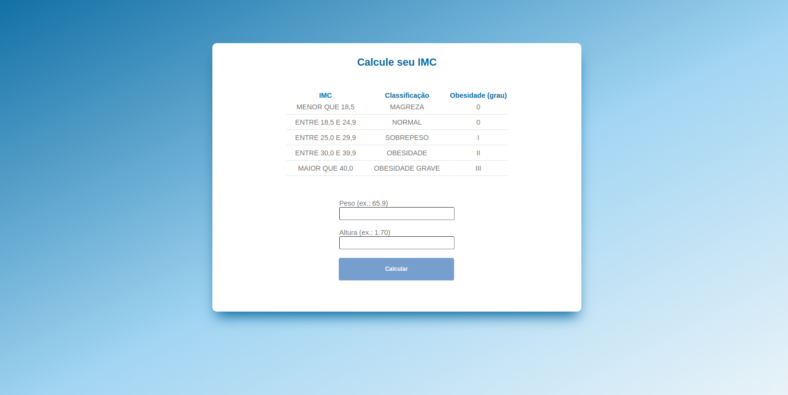

# IMC_Calculator
Uma calculadora de IMC utilizando HTML, CSS e JavaScript. 

## Descrição 
Aplicação que calcula IMC, mostrando diferentes níveis e bloqueando caso o usuário coloque alguma informação inválida. 

## Conhecimentos adquiridos
Pude trabalhar ainda mais com functions no JavaScript e entender melhor o seu funcionamento. Além de novos recursos para CSS como o botão animado. 

## Link
https://imc-calculator-smoky.vercel.app/
